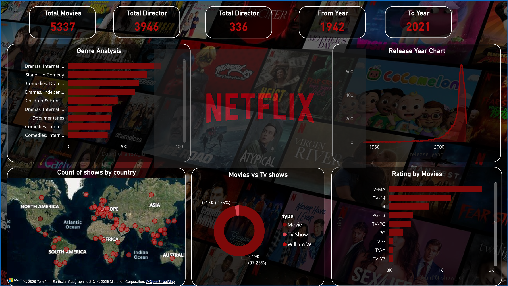

# Netflix-Analytics-Dashboard
## Project : Netflix Data Analytics Dashboard

**Tools Used**: Power BI, Excel

**About**:
Analyzed Netflix dataset of 5337+ titles to uncover trends in Movies vs TV Shows, top genres, country-wise content, and release year patterns from 1942 to 2021.

**Key Insights**:
- **Total Content**: 5337 Titles, 3946 Directors
- **Genre Analysis**: Drama, Comedy, Documentaries are top genres
- **Movies vs TV Shows**: 97.23% Movies, 2.75% TV Shows
- **Global Reach**: Content from 190+ countries mapped
- **Trends**: Peak content added between 2015-2021
- **Ratings**: TV-MA and TV-14 are most common ratings

[Download PBIX File](Netflix.dashboard.pbix)